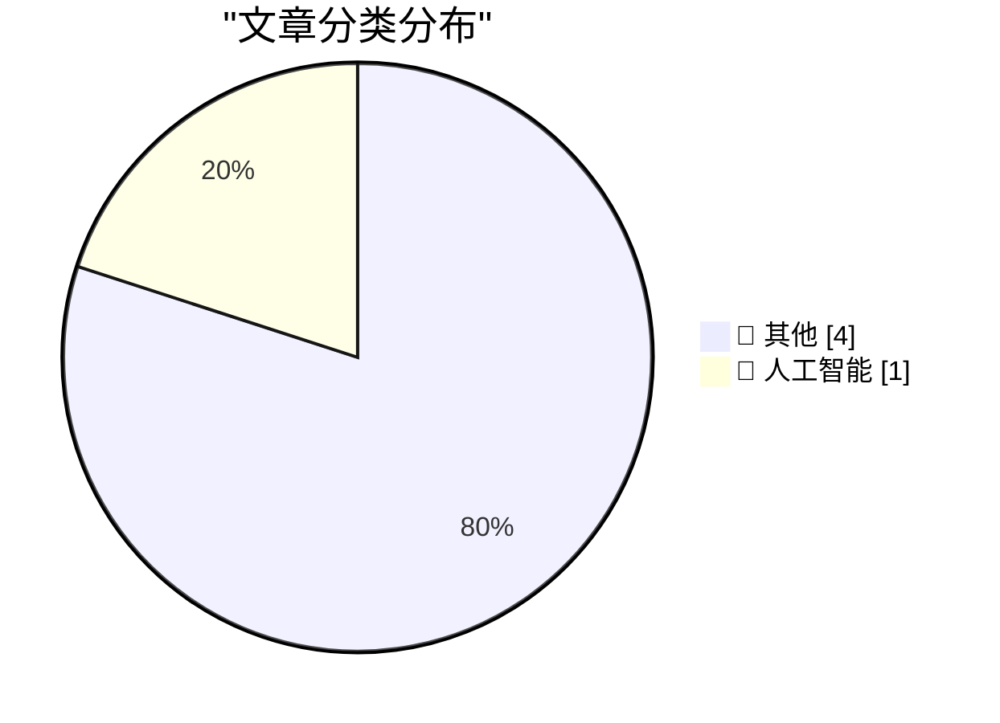
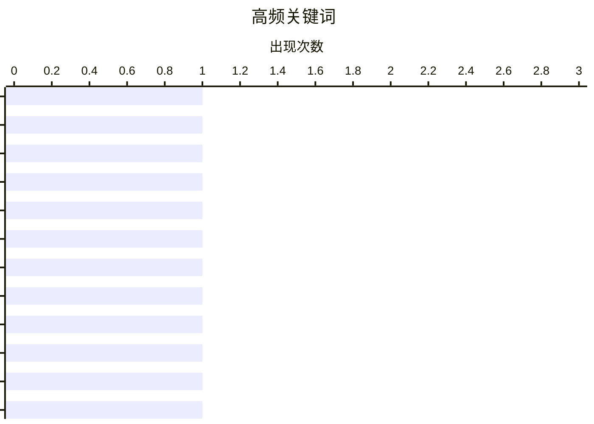

# 📰 AI 博客每日精选 — 2026-03-19

> 来自 Karpathy 推荐的 113 个顶级技术博客，AI 精选 Top 5

## 📝 今日看点

今日技术圈热点包括 AI 技术发展、软件工程实践和开源工具更新。来自多个知名技术博客的文章探讨了最新的技术趋势和实践经验，为技术从业者提供了有价值的参考。

---

## 🏆 今日必读

🥇 **科技云报到：“龙虾”OpenClaw狂欢之下，需要一针清醒剂**

[科技云报到：“龙虾”OpenClaw狂欢之下，需要一针清醒剂](https://www.anquanke.com/post/id/315195) — 安全客 · 3 小时前 · 📝 其他

> 科技云报到原创 最近打开朋友圈、短视频平台，你大概率躲不开一只红色的“龙虾”。 从职场人晒的“一键搞定周报全流 […]

💡 **为什么值得读**: 来自 安全客 的技术文章

🏷️ 科技云报到：“龙虾”OpenClaw狂欢之下，需要一针清醒剂, 科技云报到原创, 最近打开朋友圈、短视频平台，你大概率躲不开一只红色的“龙虾”。, 从职场人晒的“一键搞定周报全流

🥈 **瑞数信息入选IDC两大AI安全报告，防御OpenClaw小龙虾裸奔危机**

[瑞数信息入选IDC两大AI安全报告，防御OpenClaw小龙虾裸奔危机](https://www.anquanke.com/post/id/315209) — 安全客 · 4 小时前 · 🤖 人工智能

> 当类OpenClaw的应用迈向规模化部署阶段，安全不再是可选附加，而是支撑其全域落地与长效运行的先决条件。近日 […]

💡 **为什么值得读**: 来自 安全客 的技术文章

🏷️ 瑞数信息入选IDC两大AI安全报告，防御OpenClaw小龙虾裸奔危机, 当类OpenClaw的应用迈向规模化部署阶段，安全不再是可选附加，而是支撑其全域落地与长效运行的先决条件。近日

🥉 **2026首届汽车安全白帽黑客大会圆满收官，共筑车联网安全新生态**

[2026首届汽车安全白帽黑客大会圆满收官，共筑车联网安全新生态](https://www.anquanke.com/post/id/315197) — 安全客 · 7 小时前 · 📝 其他

> 3月13日，国内首届汽车安全白帽黑客大会在上海圆满收官。本次大会在普陀区科委、上海车联网协会的指导下，由泽鹿安 […]

💡 **为什么值得读**: 来自 安全客 的技术文章

🏷️ 2026首届汽车安全白帽黑客大会圆满收官，共筑车联网安全新生态, 3月13日，国内首届汽车安全白帽黑客大会在上海圆满收官。本次大会在普陀区科委、上海车联网协会的指导下，由泽鹿安

---

## 📊 数据概览

| 扫描源 | 抓取文章 | 时间范围 | 精选 |
|:---:|:---:|:---:|:---:|
| 17/113 | 686 篇 → 157 篇 | 24h | **5 篇** |

### 分类分布



### 高频关键词



<details>
<summary>📈 纯文本关键词图（终端友好）</summary>

```
科技云报到：“龙虾”openclaw狂欢之下，需要一针清醒剂                              │ ████████████████████ 1
科技云报到原创                                                     │ ████████████████████ 1
最近打开朋友圈、短视频平台，你大概率躲不开一只红色的“龙虾”。                             │ ████████████████████ 1
从职场人晒的“一键搞定周报全流                                             │ ████████████████████ 1
瑞数信息入选idc两大ai安全报告，防御openclaw小龙虾裸奔危机                         │ ████████████████████ 1
当类openclaw的应用迈向规模化部署阶段，安全不再是可选附加，而是支撑其全域落地与长效运行的先决条件。近日     │ ████████████████████ 1
2026首届汽车安全白帽黑客大会圆满收官，共筑车联网安全新生态                             │ ████████████████████ 1
3月13日，国内首届汽车安全白帽黑客大会在上海圆满收官。本次大会在普陀区科委、上海车联网协会的指导下，由泽鹿安     │ ████████████████████ 1
对《互联网应用程序个人信息收集使用规定（征求意见稿）》的学习浅析                            │ ████████████████████ 1
国家网信办于2026年1月10日就《互联网应用程序个人信息收集使用规定（征求意见稿）》（简称《征求意见稿》）公read │ ████████████████████ 1
```

</details>

### 🏷️ 话题标签

**科技云报到：“龙虾”openclaw狂欢之下，需要一针清醒剂**(1) · **科技云报到原创**(1) · **最近打开朋友圈、短视频平台，你大概率躲不开一只红色的“龙虾”。**(1) · 从职场人晒的“一键搞定周报全流(1) · 瑞数信息入选idc两大ai安全报告，防御openclaw小龙虾裸奔危机(1) · 当类openclaw的应用迈向规模化部署阶段，安全不再是可选附加，而是支撑其全域落地与长效运行的先决条件。近日(1) · 2026首届汽车安全白帽黑客大会圆满收官，共筑车联网安全新生态(1) · 3月13日，国内首届汽车安全白帽黑客大会在上海圆满收官。本次大会在普陀区科委、上海车联网协会的指导下，由泽鹿安(1) · 对《互联网应用程序个人信息收集使用规定（征求意见稿）》的学习浅析(1) · 国家网信办于2026年1月10日就《互联网应用程序个人信息收集使用规定（征求意见稿）》（简称《征求意见稿》）公read(1) · more(1) · rsac(1) · 2026创新沙盒(1) · humanix：面向人的社会工程攻击检测与响应(1) · conference(1)

---

## 📝 其他

### 1. 科技云报到：“龙虾”OpenClaw狂欢之下，需要一针清醒剂

[科技云报到：“龙虾”OpenClaw狂欢之下，需要一针清醒剂](https://www.anquanke.com/post/id/315195) — **安全客** · 3 小时前 · ⭐ 22/30

> 科技云报到原创 最近打开朋友圈、短视频平台，你大概率躲不开一只红色的“龙虾”。 从职场人晒的“一键搞定周报全流 […]

🏷️ 科技云报到：“龙虾”OpenClaw狂欢之下，需要一针清醒剂, 科技云报到原创, 最近打开朋友圈、短视频平台，你大概率躲不开一只红色的“龙虾”。, 从职场人晒的“一键搞定周报全流

---

### 2. 2026首届汽车安全白帽黑客大会圆满收官，共筑车联网安全新生态

[2026首届汽车安全白帽黑客大会圆满收官，共筑车联网安全新生态](https://www.anquanke.com/post/id/315197) — **安全客** · 7 小时前 · ⭐ 22/30

> 3月13日，国内首届汽车安全白帽黑客大会在上海圆满收官。本次大会在普陀区科委、上海车联网协会的指导下，由泽鹿安 […]

🏷️ 2026首届汽车安全白帽黑客大会圆满收官，共筑车联网安全新生态, 3月13日，国内首届汽车安全白帽黑客大会在上海圆满收官。本次大会在普陀区科委、上海车联网协会的指导下，由泽鹿安

---

### 3. 对《互联网应用程序个人信息收集使用规定（征求意见稿）》的学习浅析

[对《互联网应用程序个人信息收集使用规定（征求意见稿）》的学习浅析](https://blog.nsfocus.net/%e5%af%b9%e3%80%8a%e4%ba%92%e8%81%94%e7%bd%91%e5%ba%94%e7%94%a8%e7%a8%8b%e5%ba%8f%e4%b8%aa%e4%ba%ba%e4%bf%a1%e6%81%af%e6%94%b6%e9%9b%86%e4%bd%bf%e7%94%a8%e8%a7%84%e5%ae%9a%ef%bc%88%e5%be%81%e6%b1%82/) — **绿盟科技博客** · 1 小时前 · ⭐ 22/30

> 国家网信办于2026年1月10日就《互联网应用程序个人信息收集使用规定（征求意见稿）》（简称《征求意见稿》）公Read More

🏷️ 对《互联网应用程序个人信息收集使用规定（征求意见稿）》的学习浅析, 国家网信办于2026年1月10日就《互联网应用程序个人信息收集使用规定（征求意见稿）》（简称《征求意见稿》）公Read, More

---

### 4. RSAC 2026创新沙盒 | Humanix：面向人的社会工程攻击检测与响应

[RSAC 2026创新沙盒 | Humanix：面向人的社会工程攻击检测与响应](https://blog.nsfocus.net/rsac-2026%e5%88%9b%e6%96%b0%e6%b2%99%e7%9b%92-humanix%ef%bc%9a%e9%9d%a2%e5%90%91%e4%ba%ba%e7%9a%84%e7%a4%be%e4%bc%9a%e5%b7%a5%e7%a8%8b%e6%94%bb%e5%87%bb%e6%a3%80%e6%b5%8b%e4%b8%8e%e5%93%8d%e5%ba%94/) — **绿盟科技博客** · 2 小时前 · ⭐ 22/30

> RSA Conference 2026 将于美国旧金山时间3月23日正式启幕。作为全球网络安全行业创新风向标，Read More

🏷️ RSAC, 2026创新沙盒, Humanix：面向人的社会工程攻击检测与响应, Conference

---

## 🤖 人工智能

### 5. 瑞数信息入选IDC两大AI安全报告，防御OpenClaw小龙虾裸奔危机

[瑞数信息入选IDC两大AI安全报告，防御OpenClaw小龙虾裸奔危机](https://www.anquanke.com/post/id/315209) — **安全客** · 4 小时前 · ⭐ 22/30

> 当类OpenClaw的应用迈向规模化部署阶段，安全不再是可选附加，而是支撑其全域落地与长效运行的先决条件。近日 […]

🏷️ 瑞数信息入选IDC两大AI安全报告，防御OpenClaw小龙虾裸奔危机, 当类OpenClaw的应用迈向规模化部署阶段，安全不再是可选附加，而是支撑其全域落地与长效运行的先决条件。近日

---

*生成于 2026-03-19 12:04 | 扫描 17 源 → 获取 686 篇 → 精选 5 篇*
*基于 [Hacker News Popularity Contest 2025](https://refactoringenglish.com/tools/hn-popularity/) RSS 源列表，由 [Andrej Karpathy](https://x.com/karpathy) 推荐*
*由「拥抱AI」制作，欢迎关注同名微信公众号获取更多 AI 实用技巧 💡*
